# SQL Sales Data Analysis

## Project Overview

This project analyzes sales data using MySQL and focuses on data validation, customer analysis, product analysis, revenue analysis, business KPIs, and advanced SQL concepts.

The project uses three related datasets: **Customers, Products, and Orders**. The data was prepared and validated before being analyzed in **MySQL Workbench 8.0 CE**.

The objective of this project is to transform raw sales data into meaningful business insights and demonstrate practical SQL skills used in data analyst roles.

---

## Objectives

- Create and manage a relational sales database.
- Validate the quality and consistency of the data.
- Analyze customer purchasing behavior.
- Evaluate product, category, and brand performance.
- Calculate important business KPIs.
- Analyze sales trends over time.
- Identify valuable and high-performing customers.
- Apply advanced SQL concepts to solve business problems.

---

## Tools Used

- **Microsoft Excel** – Data preparation and dataset handling
- **Microsoft Power Query** – Data cleaning and transformation
- **MySQL Workbench 8.0 CE** – Database management and SQL analysis
- **GitHub** – Project documentation and version control

---

## Dataset

The project uses three related datasets:

| Dataset | Description |
|---|---|
| `Customers_Dataset.csv` | Contains customer information such as customer ID, name, city, state, signup date, and customer segment |
| `Products_Dataset.csv` | Contains product information such as product ID, product name, category, subcategory, brand, price, and cost |
| `Orders_Dataset.csv` | Contains order information such as order ID, order date, customer ID, product ID, quantity, discount, and sales |

---

## Database Schema

The database contains three related tables:

### Customers Table

| Column | Data Type | Description |
|---|---|---|
| `customer_id` | VARCHAR(50) | Unique customer ID |
| `first_name` | VARCHAR(50) | Customer first name |
| `last_name` | VARCHAR(50) | Customer last name |
| `city` | VARCHAR(50) | Customer city |
| `state` | VARCHAR(50) | Customer state |
| `signup_date` | DATE | Customer signup date |
| `segment` | VARCHAR(50) | Customer segment |

### Products Table

| Column | Data Type | Description |
|---|---|---|
| `product_id` | VARCHAR(50) | Unique product ID |
| `product_name` | VARCHAR(50) | Product name |
| `category` | VARCHAR(50) | Product category |
| `subcategory` | VARCHAR(50) | Product subcategory |
| `brand` | VARCHAR(50) | Product brand |
| `price` | DECIMAL(10,2) | Product selling price |
| `cost` | DECIMAL(10,2) | Product cost |

### Orders Table

| Column | Data Type | Description |
|---|---|---|
| `order_id` | VARCHAR(50) | Unique order ID |
| `order_date` | DATE | Date on which the order was placed |
| `customer_id` | VARCHAR(50) | Customer ID |
| `product_id` | VARCHAR(50) | Product ID |
| `quantity` | INT | Number of units ordered |
| `discount` | DECIMAL(4,2) | Discount applied to the order |
| `sales` | DECIMAL(12,2) | Final sales amount after applying the discount |

---

## Database Relationships

The `orders` table connects the `customers` and `products` tables.

```text
Customers
    │
    │ customer_id
    ▼
Orders
    ▲
    │ product_id
    │
Products
```

### Keys

- `customers.customer_id` → Primary Key
- `products.product_id` → Primary Key
- `orders.order_id` → Primary Key
- `orders.customer_id` → Foreign Key referencing `customers.customer_id`
- `orders.product_id` → Foreign Key referencing `products.product_id`

---

## Sales and Profit Calculation

The sales amount was calculated using the product price, quantity, and discount.

```text
Sales = Price × Quantity × (1 - Discount)
```

Profit was calculated using the final sales amount and product cost.

```text
Profit = Sales - (Cost × Quantity)
```

Since the `sales` column already contains the amount after applying the discount, the discount is not deducted again while calculating profit.

---

## Project Workflow

```text
Sales Datasets
      ↓
Data Preparation and Cleaning
      ↓
Database Creation
      ↓
Data Validation
      ↓
Business Analysis
      ↓
KPI Analysis
      ↓
Advanced SQL Concepts
      ↓
Business Insights
```

---

## SQL Files

### 1. Database Setup and Data Validation

This file includes:

- Database and table setup
- Data type checks
- Primary key validation
- Foreign key validation
- Duplicate record checks
- NULL value checks
- Data quality assessment
- Data standardization
- Data validation
- String functions
- Date functions
- Aggregate functions

### 2. Business Analysis and Reporting

This file includes:

- Customer analysis
- Product analysis
- Category analysis
- Brand analysis
- Location analysis
- Revenue analysis
- Profit analysis
- Customer spending analysis
- Monthly, quarterly, and yearly analysis
- Business-focused SQL queries

### 3. Advanced SQL Concepts and Optimization

This file includes:

- Business KPIs
- Date analysis
- Window functions
- `ROW_NUMBER()`
- `RANK()`
- `DENSE_RANK()`
- `NTILE()`
- `CASE` statements
- Subqueries
- Correlated subqueries
- Common Table Expressions (CTEs)
- Views
- Temporary tables
- Stored procedures
- Indexes
- `EXPLAIN`

---

## Key Performance Indicators

The project calculates the following KPIs:

- Total Revenue
- Total Orders
- Total Quantity Sold
- Average Order Value
- Total Profit
- Average Discount
- Highest Sales
- Lowest Sales

---

## Business Analysis

The project answers questions related to:

- Top customers by revenue
- Customer purchasing behavior
- Repeat customers
- Valuable customers
- Best-selling products
- Highest-revenue products
- Product profitability
- Revenue by category
- Revenue by brand
- Revenue by state and city
- Monthly revenue trends
- Products that were never sold
- Customer spending analysis

---

## SQL Concepts Covered

- `SELECT`
- `WHERE`
- `ORDER BY`
- `GROUP BY`
- `HAVING`
- `DISTINCT`
- Aggregate functions
- `JOIN`
- `CASE`
- Subqueries
- Correlated subqueries
- Common Table Expressions (CTEs)
- Window functions
- `ROW_NUMBER()`
- `RANK()`
- `DENSE_RANK()`
- `NTILE()`
- String functions
- Date functions
- Views
- Temporary tables
- Stored procedures
- Indexes
- `EXPLAIN`

---

# Project Screenshots

## 1. Database Tables Overview

This screenshot shows the main tables created for the project.

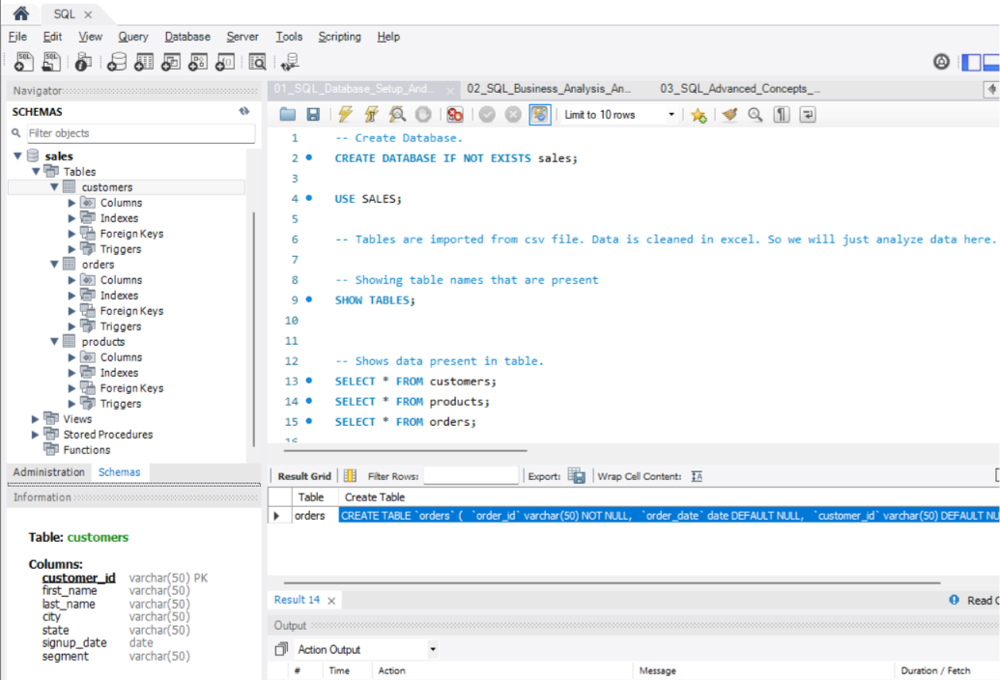

---

## 2. Customers Table Data

This screenshot displays the customer data stored in the `customers` table.

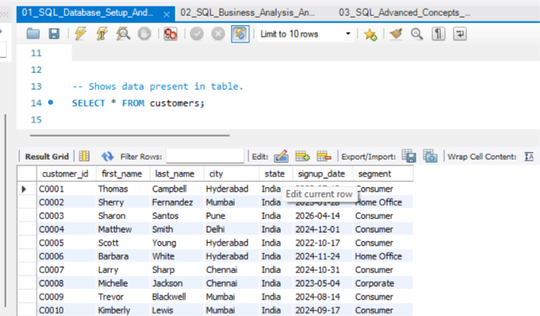

---

## 3. Products Table Data

This screenshot displays the product data stored in the `products` table.

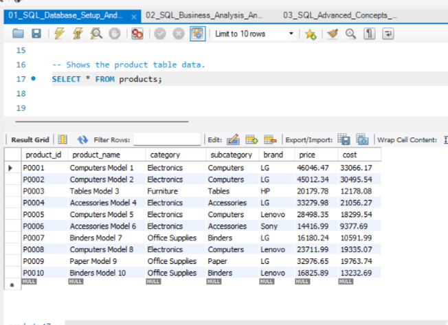

---

## 4. Orders Table Data

This screenshot displays the order data stored in the `orders` table.

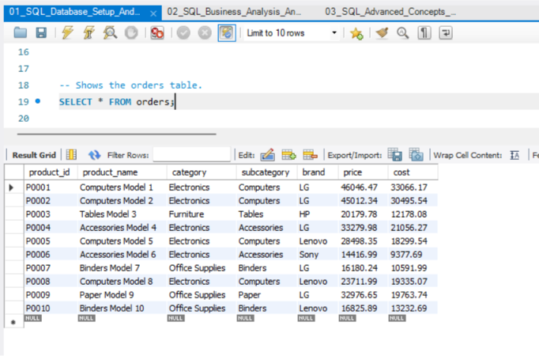

---

## 5. Duplicate Customers Check

This query checks for duplicate customer records in the dataset.

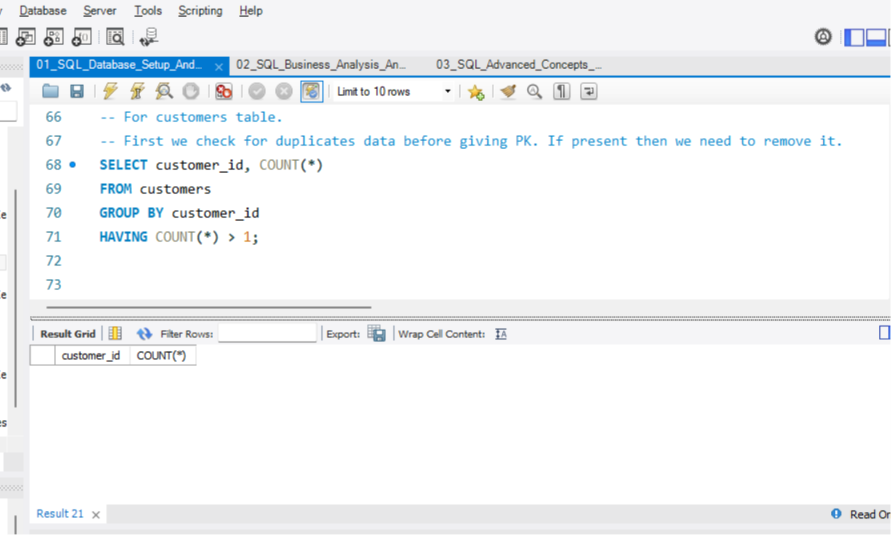

---

## 6. NULL Values Check in Customers Table

This query checks for missing or NULL values in the customers table.

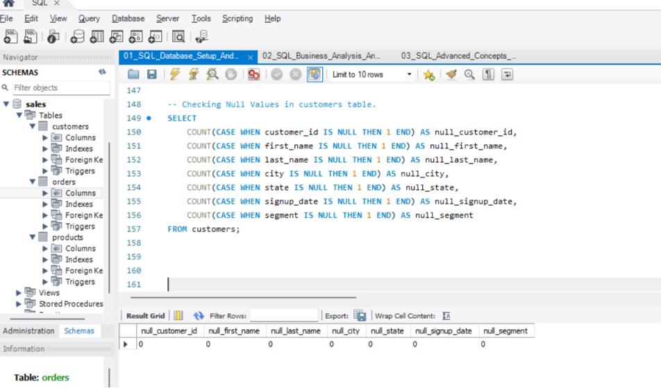

---

## 7. Top 10 Customers with Highest Revenue

This analysis identifies the top 10 customers based on their total revenue.

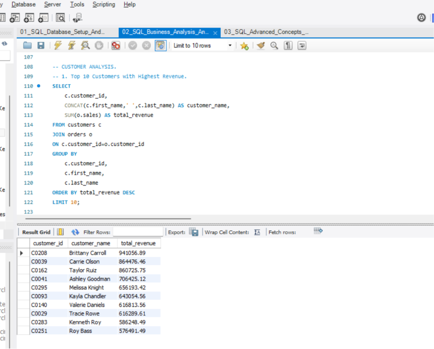

---

## 8. Top 10 Best-Selling Products

This analysis identifies the top-selling products based on the total quantity sold.

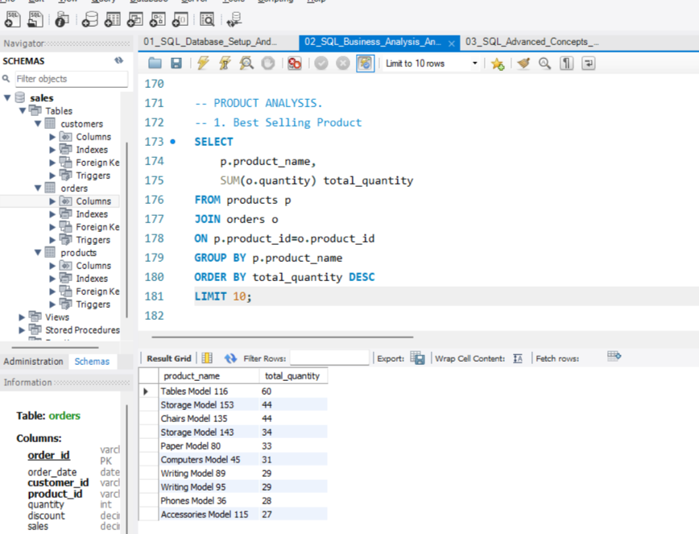

---

## 9. Revenue by Category

This analysis shows the revenue generated by each product category.

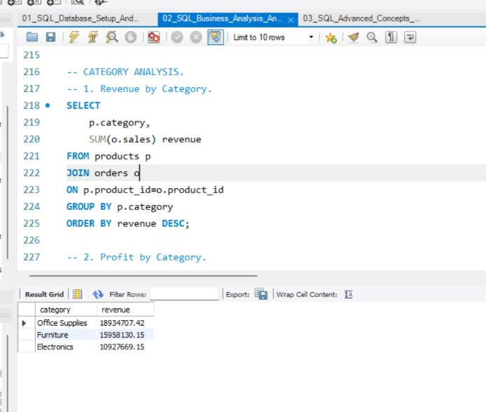

---

## 10. Revenue by Brand

This analysis compares the revenue generated by different product brands.

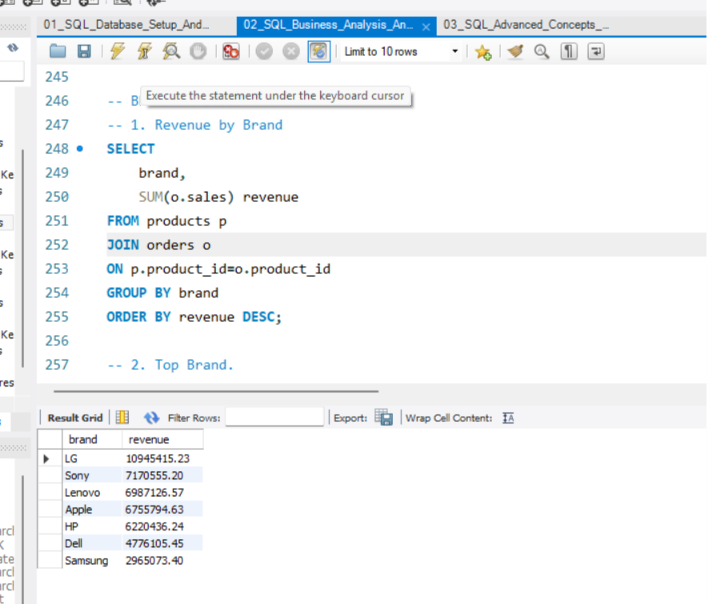

---

## 11. Monthly Revenue Analysis

This analysis shows revenue performance over time and helps identify sales trends.

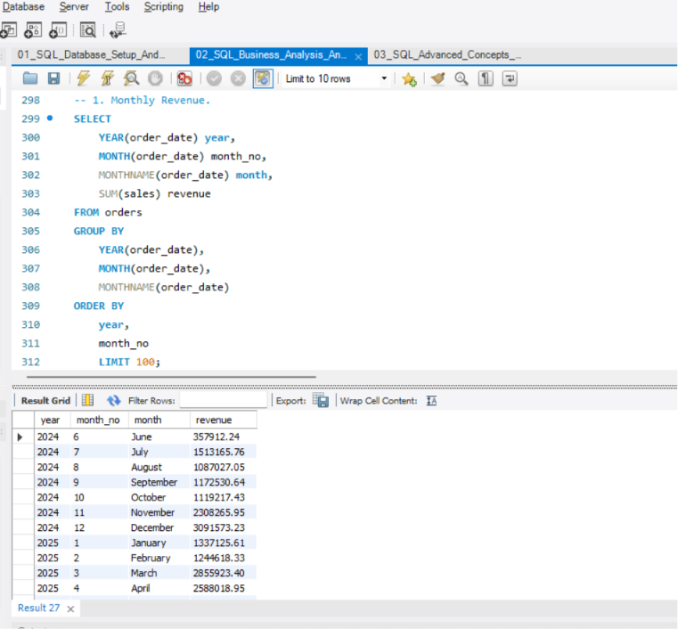

---

## 12. Products Never Sold

This analysis identifies products that have not appeared in any order.

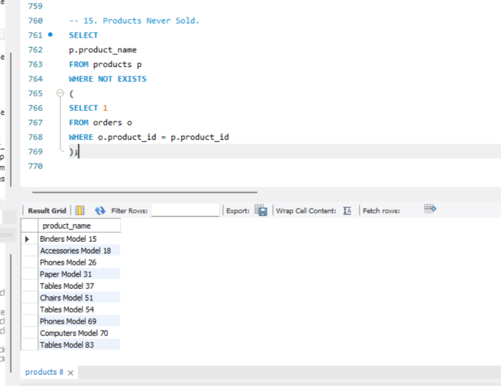

---

## 13. Valuable Customers

This analysis identifies customers who have placed at least three orders and generated total sales greater than the overall average sales.

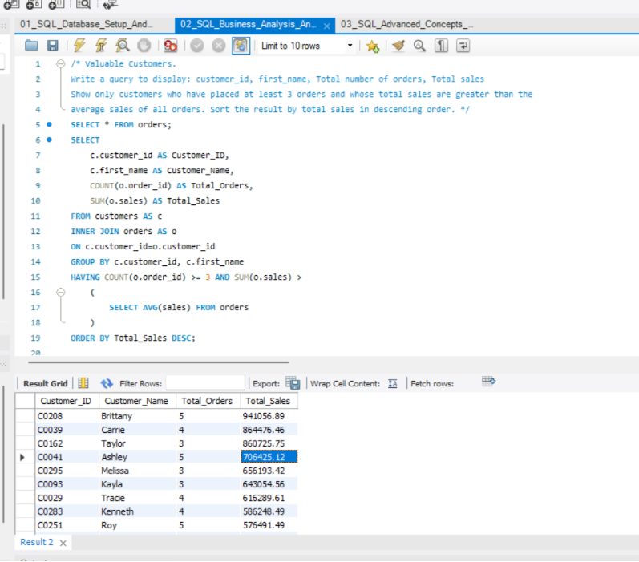

---

## 14. Identifying Best Customers

This analysis evaluates customer spending by considering total orders, total sales, and average order value.

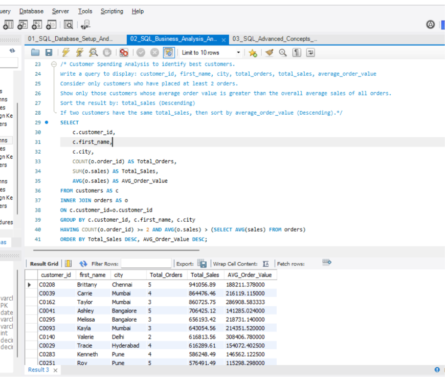

---

## Key Learnings

Through this project, I practiced and improved the following skills:

- Data cleaning and preparation
- Relational database design
- Primary and foreign key implementation
- Data validation and quality checks
- SQL-based business analysis
- Revenue and profit analysis
- KPI calculation
- Customer and product analysis
- Advanced SQL querying
- Window functions
- Subqueries and CTEs
- Creating views and stored procedures
- Basic query optimization techniques
- Converting sales data into meaningful business insights

---

## Future Improvements

Possible future improvements include:

- Building an interactive Power BI dashboard
- Creating automated sales reports
- Adding customer segmentation using RFM analysis
- Performing cohort analysis
- Creating sales forecasting models
- Adding more advanced business KPIs
- Performing additional query optimization

---

## Conclusion

This project demonstrates an end-to-end SQL sales analysis workflow, starting with data preparation and database design and continuing through data validation, business analysis, KPI reporting, and advanced SQL concepts.

The project shows how SQL can be used to analyze customer behavior, product performance, revenue trends, and business performance while converting raw sales data into useful insights.

---

## Author

**Vishal Patil**

Data Analyst | SQL | Excel | Python | Power BI

[LinkedIn Profile](https://www.linkedin.com/in/vishal-patil-338279414/)
